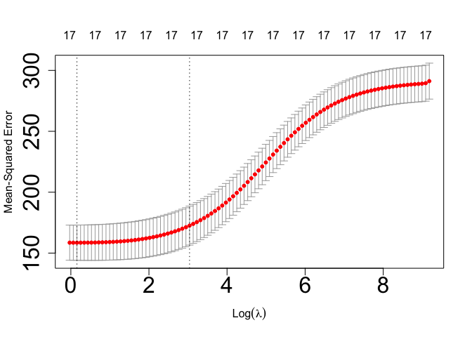
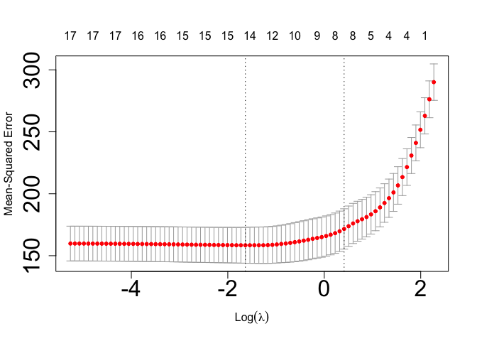

Module 4 - Regularization with Ridge/LASSO
================
Justin Ehringhaus
October 16, 2022

``` r
# █▀█ █▀▀ █▀ █▀▀ ▀█▀ █▀
# █▀▄ ██▄ ▄█ ██▄ ░█░ ▄█
# clear console
cat("\014")
```



``` r
# clear global environment
rm(list = ls())
# clear plots
try(dev.off(dev.list()["RStudioGD"]), silent = TRUE)
# clear packages
try(p_unload(p_loaded(), character.only = TRUE), silent = TRUE)
# disables scientific notion for entire R session
options(scipen = 100)

# █▀█ ▄▀█ █▀▀ █▄▀ ▄▀█ █▀▀ █▀▀ █▀
# █▀▀ █▀█ █▄▄ █░█ █▀█ █▄█ ██▄ ▄█
library(pacman)      # package manager
p_load(tidyverse)    # for ggplot and various other useful packages
p_load(ISLR)         # for the College dataset
p_load(glue)         # for printing to console
p_load(glmnet)       # cross-validation for glmnet
p_load(caret)        # tools for machine learning
p_load(ehaGoF)       # to calculate RRMSE

# █▀▀ █░░ █▀█ █▄▄ ▄▀█ █░░ █▀
# █▄█ █▄▄ █▄█ █▄█ █▀█ █▄▄ ▄█
# Global-scope tibble, model metrics added here for model comparison
compare.model.metrics <-
  tibble(Model = character(), 
         RMSE = numeric(), 
         RRMSE = numeric(),
         Rsquared = numeric(),
         Predictors = numeric())

# █░█ █▀▀ █░░ █▀█ █▀▀ █▀█ █▀
# █▀█ ██▄ █▄▄ █▀▀ ██▄ █▀▄ ▄█
# Outputs a (glue) string, prettified for console printing
pretty_glue <- function(string) {
  border <- strrep('*', 80)
  eval.string <- glue(string)
  return(cat(border, eval.string, border, sep = '\n'))
}

# Adds model metrics to the global-scope tibble for model comparison
model_performance <- function(model, row.name, x.actual, y.actual) {
  y.predicted <- model %>% predict(x.actual)
  metrics <- postResample(y.predicted, y.actual)
  already.exists <- row.name %in% compare.model.metrics$Model
  if(!already.exists) {
    compare.model.metrics <<-compare.model.metrics %>% 
      add_row(Model = row.name, 
              RMSE = metrics['RMSE'],
              RRMSE = gofRRMSE(y.actual, y.predicted),
              Rsquared = metrics['Rsquared'],
              Predictors = sum(coef(model) != 0, na.rm = TRUE) - 1) 
  }
  compare.model.metrics
}

# Comparison of coefficients in model1/model2 with percent increase/decrease
coef.comparison <- function(model1, model2) {
  data.frame(no.penalty.coefs = as.numeric(coef(model1)), 
             penalty.coefs = as.numeric(coef(model2))) %>% 
    mutate(percent.change = 
             round((((penalty.coefs - no.penalty.coefs) / abs(no.penalty.coefs))
                    * 100), 2)) %>% 
    na_if(0)
}

# █▄▀ █▀▀ █▄█   ▀█▀ █▀▀ █▀█ █▀▄▀█ █▀
# █░█ ██▄ ░█░   ░█░ ██▄ █▀▄ █░▀░█ ▄█
# `Ridge`: L2 regularization. Will not shrink coefficients to zero, so it is used 
# when the number of predictors exceeds the number of observations.
# 
# Lasso`: L1 regularization. Can reduce coefficients to zero and eliminate, so it
# can be used for feature selection and eliminate variables.
# 
# `Lambda`: The tuning parameter for L1 or L2 penalty. When Lamba = 0, the result 
# is the same as linear regression and no coefficients are eliminated. When Lambda =
# infinity, all coefficients are eliminated (Lasso) / all coefficients are reduced
# by the same factor and approach zero (Ridge). Finding the optimal value of lambda
# is critical for both Ridge and Lasso methods.
# 
# `Alpha`: Controls mix of regularization types. 
# Alpha = 1 in Lasso model, Alpha = 0 in Ridge model
# 
# `Bias`: Increases as lambda increases.
# `Variance`: Increases as lamdba decreases.
# 
# Advantage of Lasso (L1 regularization): Produces simpler models by reducing 
# coefficients to zero. However, models should be cross-validated to see which
# method produces better results.
# 
# `Parsimonious model`: A parsimonious model is a model that accomplishes the 
# desired level of explanation or prediction with as few predictor variables as 
# possible.

# █░░ █▀█ ▄▀█ █▀▄   █▀▄ ▄▀█ ▀█▀ ▄▀█
# █▄▄ █▄█ █▀█ █▄▀   █▄▀ █▀█ ░█░ █▀█
pretty_glue("Importing the data and ensuring there are no missing values.")
```

    ## ********************************************************************************
    ## Importing the data and ensuring there are no missing values.
    ## ********************************************************************************

``` r
college.data <- as_tibble(ISLR::College) %>% na.omit

# ▀█▀ █▀█ ▄▀█ █ █▄░█   ░░▄▀   ▀█▀ █▀▀ █▀ ▀█▀
# ░█░ █▀▄ █▀█ █ █░▀█   ▄▀░░   ░█░ ██▄ ▄█ ░█░
pretty_glue("Creating a 70% / 30% split")
```

    ## ********************************************************************************
    ## Creating a 70% / 30% split
    ## ********************************************************************************

``` r
college.train <- college.data %>% slice_sample(prop = 0.70)
college.test <- college.data %>% setdiff(college.train)

# █▀█ █ █▀▄ █▀▀ █▀▀
# █▀▄ █ █▄▀ █▄█ ██▄
pretty_glue("Setting up the model matrices for the predictors (x) and the vector 
for the dependent variable (y) for both train and test sets.")
```

    ## ********************************************************************************
    ## Setting up the model matrices for the predictors (x) and the vector 
    ## for the dependent variable (y) for both train and test sets.
    ## ********************************************************************************

``` r
x.train.actual <- model.matrix(Grad.Rate ~ ., college.train)[, -1]
y.train.actual <- college.train$Grad.Rate
x.test.actual <- model.matrix(Grad.Rate ~ ., college.test)[, -1]
y.test.actual <- college.test$Grad.Rate
pretty_glue("cv.glmnet() by default performs 10-fold cross-validation. Alpha is
set to zero for Ridge models.")
```

    ## ********************************************************************************
    ## cv.glmnet() by default performs 10-fold cross-validation. Alpha is
    ## set to zero for Ridge models.
    ## ********************************************************************************

``` r
set.seed(44)
ridge.cv <- cv.glmnet(x.train.actual, y.train.actual, alpha = 0)
pretty_glue("{round(ridge.cv$lambda.min, 3)} is the minimum value of lambda that 
minimizes the out-of-sample loss.\n
{round(ridge.cv$lambda.1se, 3)} represents the maximum value of lambda that is 
within 1 standard error (1se) from the minimum.\n
To avoid overfitting, the 1se model is considered the most parsimonious.")
```

    ## ********************************************************************************
    ## 1.169 is the minimum value of lambda that 
    ## minimizes the out-of-sample loss.
    ## 
    ## 20.903 represents the maximum value of lambda that is 
    ## within 1 standard error (1se) from the minimum.
    ## 
    ## To avoid overfitting, the 1se model is considered the most parsimonious.
    ## ********************************************************************************

``` r
plot(ridge.cv, 
     cex.lab = 1,
     cex.axis = 2)
```

<!-- -->

``` r
pretty_glue("The x-axis represents the log of lamba, and the y-axis is the mean-
squared-error. The vertical dashed line of the left-side represents the log of the
minimum value of lambda that minimizes the out-of-sample loss, and the one on the
right-side represents the log of the maximum value of lambda that is within 1se
from the minimum. When lambda = 0, there is no penalty to the coefficients, thus 
producing typical least-squares coefficients. As the vertical dashed lines point 
to a relatively low value of lambda, the coefficients will be penalized, but only 
slightly. The RMSE goes up significantly as the value of lambda increases. It is 
ideal to minimize RMSE (thus maximizing the quality of predictions) while 
avoiding overfitting (thus penalizing coefficients to some extent).")
```

    ## ********************************************************************************
    ## The x-axis represents the log of lamba, and the y-axis is the mean-
    ## squared-error. The vertical dashed line of the left-side represents the log of the
    ## minimum value of lambda that minimizes the out-of-sample loss, and the one on the
    ## right-side represents the log of the maximum value of lambda that is within 1se
    ## from the minimum. When lambda = 0, there is no penalty to the coefficients, thus 
    ## producing typical least-squares coefficients. As the vertical dashed lines point 
    ## to a relatively low value of lambda, the coefficients will be penalized, but only 
    ## slightly. The RMSE goes up significantly as the value of lambda increases. It is 
    ## ideal to minimize RMSE (thus maximizing the quality of predictions) while 
    ## avoiding overfitting (thus penalizing coefficients to some extent).
    ## ********************************************************************************

``` r
null.model <- glmnet(x.train.actual, y.train.actual, 
                     alpha = 0, lambda = 0)
ridge.fit.lambda.1se <- glmnet(x.train.actual, y.train.actual, 
                               alpha = 0, lambda = ridge.cv$lambda.1se)
null.vs.ridge.coefs <- coef.comparison(null.model, ridge.fit.lambda.1se)
null.vs.ridge.coefs
```

    ##    no.penalty.coefs  penalty.coefs percent.change
    ## 1     31.4430526567 39.53117757698          25.72
    ## 2      3.7742739589  2.58792829275         -31.43
    ## 3      0.0019222660  0.00027444817         -85.72
    ## 4     -0.0002584011  0.00026837462         203.86
    ## 5      0.0015749457  0.00012137053         -92.29
    ## 6      0.0960119904  0.08632498702         -10.09
    ## 7      0.1195842004  0.07664223627         -35.91
    ## 8     -0.0008824519 -0.00005246819          94.05
    ## 9     -0.0009662210 -0.00070253673          27.29
    ## 10     0.0010908714  0.00050736599         -53.49
    ## 11     0.0019412865  0.00139286276         -28.25
    ## 12    -0.0003855847 -0.00062990660         -63.36
    ## 13    -0.0015624350 -0.00155075678           0.75
    ## 14     0.0763635921  0.03720031874         -51.29
    ## 15    -0.0854261102  0.02313069841         127.08
    ## 16     0.1957910826 -0.03729770096        -119.05
    ## 17     0.2945944624  0.15336875640         -47.94
    ## 18    -0.0006159321  0.00003494600         105.67

``` r
pretty_glue("A good way to judge the influence of the lambda value on coefficients 
in the ridge fit is to compare it to coefficients in a classical, ordinary least
squares method fit (null.model). Interestingly, some coefficients have increased rather than 
decreased.\n 
The percent.change column in the above dataframe shows most coefficients have
decreased but at differing amounts. For instance, `S.F. Ratio` has experienced a
233% decrease, while `PrivateYes` has only experienced a 37% decrease.")
```

    ## ********************************************************************************
    ## A good way to judge the influence of the lambda value on coefficients 
    ## in the ridge fit is to compare it to coefficients in a classical, ordinary least
    ## squares method fit (null.model). Interestingly, some coefficients have increased rather than 
    ## decreased.
    ##  
    ## The percent.change column in the above dataframe shows most coefficients have
    ## decreased but at differing amounts. For instance, `S.F. Ratio` has experienced a
    ## 233% decrease, while `PrivateYes` has only experienced a 37% decrease.
    ## ********************************************************************************

``` r
model_performance(model = null.model, 
                  row.name = 'null.model.train', 
                  x.actual = x.train.actual, 
                  y.actual = y.train.actual)
```

    ## # A tibble: 1 × 5
    ##   Model             RMSE RRMSE Rsquared Predictors
    ##   <chr>            <dbl> <dbl>    <dbl>      <dbl>
    ## 1 null.model.train  12.2  18.7    0.488         17

``` r
model_performance(model = null.model, 
                  row.name = 'null.model.test', 
                  x.actual = x.test.actual, 
                  y.actual = y.test.actual)
```

    ## # A tibble: 2 × 5
    ##   Model             RMSE RRMSE Rsquared Predictors
    ##   <chr>            <dbl> <dbl>    <dbl>      <dbl>
    ## 1 null.model.train  12.2  18.7    0.488         17
    ## 2 null.model.test   14.0  21.3    0.380         17

``` r
model_performance(model = ridge.fit.lambda.1se, 
                  row.name = 'ridge.lamdba.1se.train', 
                  x.actual = x.train.actual, 
                  y.actual = y.train.actual)
```

    ## # A tibble: 3 × 5
    ##   Model                   RMSE RRMSE Rsquared Predictors
    ##   <chr>                  <dbl> <dbl>    <dbl>      <dbl>
    ## 1 null.model.train        12.2  18.7    0.488         17
    ## 2 null.model.test         14.0  21.3    0.380         17
    ## 3 ridge.lamdba.1se.train  13.0  19.9    0.446         17

``` r
model_performance(model = ridge.fit.lambda.1se, 
                  row.name = 'ridge.lamdba.1se.test', 
                  x.actual = x.test.actual, 
                  y.actual = y.test.actual)
```

    ## # A tibble: 4 × 5
    ##   Model                   RMSE RRMSE Rsquared Predictors
    ##   <chr>                  <dbl> <dbl>    <dbl>      <dbl>
    ## 1 null.model.train        12.2  18.7    0.488         17
    ## 2 null.model.test         14.0  21.3    0.380         17
    ## 3 ridge.lamdba.1se.train  13.0  19.9    0.446         17
    ## 4 ridge.lamdba.1se.test   13.5  20.5    0.417         17

``` r
pretty_glue("Predicting on the test set versus the train set sees a slight decrease
in RMSE and R-squared values, but these are overall similar.")
```

    ## ********************************************************************************
    ## Predicting on the test set versus the train set sees a slight decrease
    ## in RMSE and R-squared values, but these are overall similar.
    ## ********************************************************************************

``` r
ridge.fit.lambda.min <- glmnet(x.train.actual, y.train.actual, 
                               alpha = 0, lambda = ridge.cv$lambda.min)
model_performance(model = ridge.fit.lambda.min, 
                  row.name = 'ridge.lamdba.min.train', 
                  x.actual = x.train.actual, 
                  y.actual = y.train.actual)
```

    ## # A tibble: 5 × 5
    ##   Model                   RMSE RRMSE Rsquared Predictors
    ##   <chr>                  <dbl> <dbl>    <dbl>      <dbl>
    ## 1 null.model.train        12.2  18.7    0.488         17
    ## 2 null.model.test         14.0  21.3    0.380         17
    ## 3 ridge.lamdba.1se.train  13.0  19.9    0.446         17
    ## 4 ridge.lamdba.1se.test   13.5  20.5    0.417         17
    ## 5 ridge.lamdba.min.train  12.2  18.7    0.485         17

``` r
model_performance(model = ridge.fit.lambda.min, 
                  row.name = 'ridge.lamdba.min.test', 
                  x.actual = x.test.actual, 
                  y.actual = y.test.actual)
```

    ## # A tibble: 6 × 5
    ##   Model                   RMSE RRMSE Rsquared Predictors
    ##   <chr>                  <dbl> <dbl>    <dbl>      <dbl>
    ## 1 null.model.train        12.2  18.7    0.488         17
    ## 2 null.model.test         14.0  21.3    0.380         17
    ## 3 ridge.lamdba.1se.train  13.0  19.9    0.446         17
    ## 4 ridge.lamdba.1se.test   13.5  20.5    0.417         17
    ## 5 ridge.lamdba.min.train  12.2  18.7    0.485         17
    ## 6 ridge.lamdba.min.test   13.6  20.7    0.398         17

``` r
pretty_glue("Predicting on the test set versus the train set sees a slight decrease 
in RMSE and R-squared values, but these are overall similar. As expected, a
smaller value of lambda decreases the RMSE, but the chance of overfitting
becomes greater as lambda decreases.\n
The null model (ordinary least squares) sees a slight increase in RMSE between 
train and test sets, which points to some overfitting. The model performs less
well on the test set. On the other hand, both ridge models see a slight decrease
in RMSE between train and test sets, which points to an optimal fit.")
```

    ## ********************************************************************************
    ## Predicting on the test set versus the train set sees a slight decrease 
    ## in RMSE and R-squared values, but these are overall similar. As expected, a
    ## smaller value of lambda decreases the RMSE, but the chance of overfitting
    ## becomes greater as lambda decreases.
    ## 
    ## The null model (ordinary least squares) sees a slight increase in RMSE between 
    ## train and test sets, which points to some overfitting. The model performs less
    ## well on the test set. On the other hand, both ridge models see a slight decrease
    ## in RMSE between train and test sets, which points to an optimal fit.
    ## ********************************************************************************

``` r
# █░░ ▄▀█ █▀ █▀ █▀█
# █▄▄ █▀█ ▄█ ▄█ █▄█
pretty_glue("cv.glmnet() by default performs 10-fold cross-validation. Alpha is
set to one for Lasso models.")
```

    ## ********************************************************************************
    ## cv.glmnet() by default performs 10-fold cross-validation. Alpha is
    ## set to one for Lasso models.
    ## ********************************************************************************

``` r
set.seed(44)
lasso.cv <- cv.glmnet(x.train.actual, y.train.actual, alpha = 1)
pretty_glue("{round(lasso.cv$lambda.min, 3)} is the minimum value of lambda that 
minimizes the out-of-sample loss.\n
{round(lasso.cv$lambda.1se, 3)} represents the maximum value of lambda that is 
within 1 standard error (1se) from the minimum.\n
To avoid overfitting, the 1se model is considered the most parsimonious.")
```

    ## ********************************************************************************
    ## 0.195 is the minimum value of lambda that 
    ## minimizes the out-of-sample loss.
    ## 
    ## 1.509 represents the maximum value of lambda that is 
    ## within 1 standard error (1se) from the minimum.
    ## 
    ## To avoid overfitting, the 1se model is considered the most parsimonious.
    ## ********************************************************************************

``` r
plot(lasso.cv, 
     cex.lab = 1,
     cex.axis = 2)
```

<!-- -->

``` r
pretty_glue("Unlike the Ridge model, the numbers at the top indicate the number
of predictor variables retained in the Lasso model. It appears that when the value
of lambda is between the minimum and 1 standard error from the minimum, seven
predictors are retained, and the other 10 were penalized to the extent that they 
were dropped from the Lasso model.")
```

    ## ********************************************************************************
    ## Unlike the Ridge model, the numbers at the top indicate the number
    ## of predictor variables retained in the Lasso model. It appears that when the value
    ## of lambda is between the minimum and 1 standard error from the minimum, seven
    ## predictors are retained, and the other 10 were penalized to the extent that they 
    ## were dropped from the Lasso model.
    ## ********************************************************************************

``` r
lasso.fit.lambda.1se <- glmnet(x.train.actual, y.train.actual, 
                               alpha = 1, lambda = lasso.cv$lambda.1se)
null.vs.lasso.coefs <- coef.comparison(null.model, lasso.fit.lambda.1se)
null.vs.lasso.coefs
```

    ##    no.penalty.coefs penalty.coefs percent.change
    ## 1     31.4430526567 37.7349038161          20.01
    ## 2      3.7742739589            NA        -100.00
    ## 3      0.0019222660  0.0001741542         -90.94
    ## 4     -0.0002584011            NA         100.00
    ## 5      0.0015749457            NA        -100.00
    ## 6      0.0960119904  0.0567447599         -40.90
    ## 7      0.1195842004  0.1093525163          -8.56
    ## 8     -0.0008824519            NA         100.00
    ## 9     -0.0009662210 -0.0003394506          64.87
    ## 10     0.0010908714  0.0010451832          -4.19
    ## 11     0.0019412865  0.0012386053         -36.20
    ## 12    -0.0003855847            NA         100.00
    ## 13    -0.0015624350 -0.0007923024          49.29
    ## 14     0.0763635921            NA        -100.00
    ## 15    -0.0854261102            NA         100.00
    ## 16     0.1957910826            NA        -100.00
    ## 17     0.2945944624  0.2057630151         -30.15
    ## 18    -0.0006159321            NA         100.00

``` r
pretty_glue("Compared to the ordinary least squares method, the Lasso fit shrunk
many of the predictors. Surprisingly, some predictors such as `PrivateYes` reduced 
to zero, which suggests private schools do not have a major influence on graduation
rate in terms of the fitted model. Colleges attended by top-performing high schoolers
appear to have a higher graduation rate as evidenced by the positive coefficients
in these predictors. Similarly, colleges with a higher percentage of alumni donors
also experience higher graduation rates. Colleges with more part-time students tend
to have lower graduation rates as evidenced by the negative coefficient in this
predictor.")
```

    ## ********************************************************************************
    ## Compared to the ordinary least squares method, the Lasso fit shrunk
    ## many of the predictors. Surprisingly, some predictors such as `PrivateYes` reduced 
    ## to zero, which suggests private schools do not have a major influence on graduation
    ## rate in terms of the fitted model. Colleges attended by top-performing high schoolers
    ## appear to have a higher graduation rate as evidenced by the positive coefficients
    ## in these predictors. Similarly, colleges with a higher percentage of alumni donors
    ## also experience higher graduation rates. Colleges with more part-time students tend
    ## to have lower graduation rates as evidenced by the negative coefficient in this
    ## predictor.
    ## ********************************************************************************

``` r
model_performance(model = lasso.fit.lambda.1se, 
                  row.name = 'lasso.lamdba.1se.train', 
                  x.actual = x.train.actual, 
                  y.actual = y.train.actual)
```

    ## # A tibble: 7 × 5
    ##   Model                   RMSE RRMSE Rsquared Predictors
    ##   <chr>                  <dbl> <dbl>    <dbl>      <dbl>
    ## 1 null.model.train        12.2  18.7    0.488         17
    ## 2 null.model.test         14.0  21.3    0.380         17
    ## 3 ridge.lamdba.1se.train  13.0  19.9    0.446         17
    ## 4 ridge.lamdba.1se.test   13.5  20.5    0.417         17
    ## 5 ridge.lamdba.min.train  12.2  18.7    0.485         17
    ## 6 ridge.lamdba.min.test   13.6  20.7    0.398         17
    ## 7 lasso.lamdba.1se.train  13.0  19.8    0.437          8

``` r
model_performance(model = lasso.fit.lambda.1se, 
                  row.name = 'lasso.lamdba.1se.test', 
                  x.actual = x.test.actual, 
                  y.actual = y.test.actual)
```

    ## # A tibble: 8 × 5
    ##   Model                   RMSE RRMSE Rsquared Predictors
    ##   <chr>                  <dbl> <dbl>    <dbl>      <dbl>
    ## 1 null.model.train        12.2  18.7    0.488         17
    ## 2 null.model.test         14.0  21.3    0.380         17
    ## 3 ridge.lamdba.1se.train  13.0  19.9    0.446         17
    ## 4 ridge.lamdba.1se.test   13.5  20.5    0.417         17
    ## 5 ridge.lamdba.min.train  12.2  18.7    0.485         17
    ## 6 ridge.lamdba.min.test   13.6  20.7    0.398         17
    ## 7 lasso.lamdba.1se.train  13.0  19.8    0.437          8
    ## 8 lasso.lamdba.1se.test   13.5  20.5    0.410          8

``` r
pretty_glue("Predicting on the test set versus the train set sees a slight decrease
in RMSE and R-squared values, but these are overall similar.")
```

    ## ********************************************************************************
    ## Predicting on the test set versus the train set sees a slight decrease
    ## in RMSE and R-squared values, but these are overall similar.
    ## ********************************************************************************

``` r
lasso.fit.lambda.min <- glmnet(x.train.actual, y.train.actual, 
                               alpha = 1, lambda = ridge.cv$lambda.min)
model_performance(model = lasso.fit.lambda.min, 
                  row.name = 'lasso.lamdba.min.train', 
                  x.actual = x.train.actual, 
                  y.actual = y.train.actual)
```

    ## # A tibble: 9 × 5
    ##   Model                   RMSE RRMSE Rsquared Predictors
    ##   <chr>                  <dbl> <dbl>    <dbl>      <dbl>
    ## 1 null.model.train        12.2  18.7    0.488         17
    ## 2 null.model.test         14.0  21.3    0.380         17
    ## 3 ridge.lamdba.1se.train  13.0  19.9    0.446         17
    ## 4 ridge.lamdba.1se.test   13.5  20.5    0.417         17
    ## 5 ridge.lamdba.min.train  12.2  18.7    0.485         17
    ## 6 ridge.lamdba.min.test   13.6  20.7    0.398         17
    ## 7 lasso.lamdba.1se.train  13.0  19.8    0.437          8
    ## 8 lasso.lamdba.1se.test   13.5  20.5    0.410          8
    ## 9 lasso.lamdba.min.train  12.8  19.6    0.446          8

``` r
model_performance(model = lasso.fit.lambda.min, 
                  row.name = 'lasso.lamdba.min.test', 
                  x.actual = x.test.actual, 
                  y.actual = y.test.actual)
```

    ## # A tibble: 10 × 5
    ##    Model                   RMSE RRMSE Rsquared Predictors
    ##    <chr>                  <dbl> <dbl>    <dbl>      <dbl>
    ##  1 null.model.train        12.2  18.7    0.488         17
    ##  2 null.model.test         14.0  21.3    0.380         17
    ##  3 ridge.lamdba.1se.train  13.0  19.9    0.446         17
    ##  4 ridge.lamdba.1se.test   13.5  20.5    0.417         17
    ##  5 ridge.lamdba.min.train  12.2  18.7    0.485         17
    ##  6 ridge.lamdba.min.test   13.6  20.7    0.398         17
    ##  7 lasso.lamdba.1se.train  13.0  19.8    0.437          8
    ##  8 lasso.lamdba.1se.test   13.5  20.5    0.410          8
    ##  9 lasso.lamdba.min.train  12.8  19.6    0.446          8
    ## 10 lasso.lamdba.min.test   13.4  20.4    0.414          8

``` r
pretty_glue("Predicting on the test set versus the train set sees a slight increase
in the RMSE value and a decrease in the R-squared value, but these are overall 
similar. In this case, when the value of lambda is between the minimum and 1 
standard error from the minimum, the model performed slightly better in terms of
the RMSE and R-squared values.\n
RMSE does not change for the `1se` lasso model, but it goes up slightly for the 
`min` lasso model. This suggests the first is an optimal fit while there may be 
some slight overfitting on the second.\n
Finally, the change in the number of predictors between the `1se` lasso model
and the `min` lasso model should be noted. As the value of lambda changes,
even slightly, the number of predictors similarly changes! The `min` lasso model
only used 4 predictors, thus becoming the least complex model of the lot.")
```

    ## ********************************************************************************
    ## Predicting on the test set versus the train set sees a slight increase
    ## in the RMSE value and a decrease in the R-squared value, but these are overall 
    ## similar. In this case, when the value of lambda is between the minimum and 1 
    ## standard error from the minimum, the model performed slightly better in terms of
    ## the RMSE and R-squared values.
    ## 
    ## RMSE does not change for the `1se` lasso model, but it goes up slightly for the 
    ## `min` lasso model. This suggests the first is an optimal fit while there may be 
    ## some slight overfitting on the second.
    ## 
    ## Finally, the change in the number of predictors between the `1se` lasso model
    ## and the `min` lasso model should be noted. As the value of lambda changes,
    ## even slightly, the number of predictors similarly changes! The `min` lasso model
    ## only used 4 predictors, thus becoming the least complex model of the lot.
    ## ********************************************************************************

``` r
# █▀▀ █▀█ █▀▄▀█ █▀█ ▄▀█ █▀█ █ █▀ █▀█ █▄░█
# █▄▄ █▄█ █░▀░█ █▀▀ █▀█ █▀▄ █ ▄█ █▄█ █░▀█
pretty_glue("Overall, both Ridge and Lasso methods produced models with very
similar RMSE and R-squared values for both train and test sets. The null model
(ordinary least squares, no penalization to coefficients) surprisingly had the
lowest RMSE and the highest R-squared value. This is not what I expected, as I 
had thought L1 and L2 regularization methods might improve model performance.
But on second thought, it makes sense that regularization methods could decrease 
performance, as their purpose is to curb overfitting.\n
Also, the number of predictors should be taken into account when choosing the
best model. While all models produced relatively similar results, the lasso models
only required 7 predictors while the others required 17 predictors.\n
Finally, I will perform step-wise selection and fit a model to see if this method
produces better results than the previous.")
```

    ## ********************************************************************************
    ## Overall, both Ridge and Lasso methods produced models with very
    ## similar RMSE and R-squared values for both train and test sets. The null model
    ## (ordinary least squares, no penalization to coefficients) surprisingly had the
    ## lowest RMSE and the highest R-squared value. This is not what I expected, as I 
    ## had thought L1 and L2 regularization methods might improve model performance.
    ## But on second thought, it makes sense that regularization methods could decrease 
    ## performance, as their purpose is to curb overfitting.
    ## 
    ## Also, the number of predictors should be taken into account when choosing the
    ## best model. While all models produced relatively similar results, the lasso models
    ## only required 7 predictors while the others required 17 predictors.
    ## 
    ## Finally, I will perform step-wise selection and fit a model to see if this method
    ## produces better results than the previous.
    ## ********************************************************************************

``` r
ols.fit <- lm(Grad.Rate ~., data = college.train)
invisible(capture.output(stepwise <- step(ols.fit, direction = 'both')))
model_performance(model = stepwise, 
                  row.name = 'stepwise.train', 
                  x.actual = college.train, 
                  y.actual = college.train$Grad.Rate)
```

    ## # A tibble: 11 × 5
    ##    Model                   RMSE RRMSE Rsquared Predictors
    ##    <chr>                  <dbl> <dbl>    <dbl>      <dbl>
    ##  1 null.model.train        12.2  18.7    0.488         17
    ##  2 null.model.test         14.0  21.3    0.380         17
    ##  3 ridge.lamdba.1se.train  13.0  19.9    0.446         17
    ##  4 ridge.lamdba.1se.test   13.5  20.5    0.417         17
    ##  5 ridge.lamdba.min.train  12.2  18.7    0.485         17
    ##  6 ridge.lamdba.min.test   13.6  20.7    0.398         17
    ##  7 lasso.lamdba.1se.train  13.0  19.8    0.437          8
    ##  8 lasso.lamdba.1se.test   13.5  20.5    0.410          8
    ##  9 lasso.lamdba.min.train  12.8  19.6    0.446          8
    ## 10 lasso.lamdba.min.test   13.4  20.4    0.414          8
    ## 11 stepwise.train          12.2  18.7    0.485         11

``` r
model_performance(model = stepwise, 
                  row.name = 'stepwise.test', 
                  x.actual = college.test, 
                  y.actual = college.test$Grad.Rate)
```

    ## # A tibble: 12 × 5
    ##    Model                   RMSE RRMSE Rsquared Predictors
    ##    <chr>                  <dbl> <dbl>    <dbl>      <dbl>
    ##  1 null.model.train        12.2  18.7    0.488         17
    ##  2 null.model.test         14.0  21.3    0.380         17
    ##  3 ridge.lamdba.1se.train  13.0  19.9    0.446         17
    ##  4 ridge.lamdba.1se.test   13.5  20.5    0.417         17
    ##  5 ridge.lamdba.min.train  12.2  18.7    0.485         17
    ##  6 ridge.lamdba.min.test   13.6  20.7    0.398         17
    ##  7 lasso.lamdba.1se.train  13.0  19.8    0.437          8
    ##  8 lasso.lamdba.1se.test   13.5  20.5    0.410          8
    ##  9 lasso.lamdba.min.train  12.8  19.6    0.446          8
    ## 10 lasso.lamdba.min.test   13.4  20.4    0.414          8
    ## 11 stepwise.train          12.2  18.7    0.485         11
    ## 12 stepwise.test           14.0  21.3    0.378         11

``` r
pretty_glue("The stepwise model performed similarly to the null model. However,
complexity is improved because only 9 predictors were used. Compared to the Lasso
model, the stepwise model is more complex. Also, there may be some slight
overfitting in the stepwise model as RMSE increased in the test set as compared
to the train set. Although similar overall, it is also interesting how the 
stepwise model chose some different predictor variables compared to the lasso model.\n
My preferred method is L1 Regularization with Lasso. First, because it is a simpler
model that eliminates unnecessary predictors. In other words, it seems to produce
a more parsimonious model, so long as it can produce the desired level of 
explanation. Second, cv.glmnet() produces a good visualization for how the model
can be made more or less parsimonious as the value of lambda changes. This makes
the Lasso method more decipherable in comparison to stepwise selection, which
is more difficult to interpret how it came up with its decision on which predictors
to include or throw away.")
```

    ## ********************************************************************************
    ## The stepwise model performed similarly to the null model. However,
    ## complexity is improved because only 9 predictors were used. Compared to the Lasso
    ## model, the stepwise model is more complex. Also, there may be some slight
    ## overfitting in the stepwise model as RMSE increased in the test set as compared
    ## to the train set. Although similar overall, it is also interesting how the 
    ## stepwise model chose some different predictor variables compared to the lasso model.
    ## 
    ## My preferred method is L1 Regularization with Lasso. First, because it is a simpler
    ## model that eliminates unnecessary predictors. In other words, it seems to produce
    ## a more parsimonious model, so long as it can produce the desired level of 
    ## explanation. Second, cv.glmnet() produces a good visualization for how the model
    ## can be made more or less parsimonious as the value of lambda changes. This makes
    ## the Lasso method more decipherable in comparison to stepwise selection, which
    ## is more difficult to interpret how it came up with its decision on which predictors
    ## to include or throw away.
    ## ********************************************************************************
